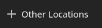
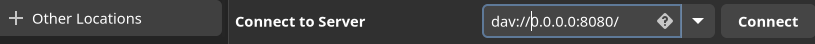
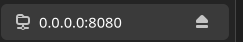
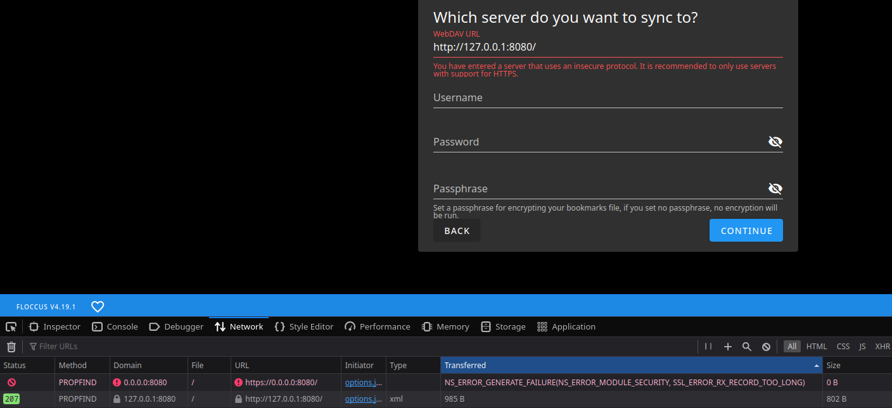

🔗 Connecting with a client
===========================

The available/applicable WebDAV operations, and URL format, depend on the client. Some
operations/access work in web browsers, while others work only in WebDAV clients.

## GNOME Files application

This is a Linux application (its executable is called `nautilus`), distributed as a part of GNOME.

- The URL must NOT start with `http://` (nor with `https://` if the server is behind a TLS proxy),
  but with `dav://` (or `davs://`, if the server is behind a TLS proxy). On Linux, the following
  addresses/network interfaces are aliases out of the box: `dav://0.0.0.0:8080`,
  `dav://127.0.0.:8080` and `dav://localhost:8080`.
- You add a connection at the bottom left: "+ Other Locations."
    - 
    - 
    - 
- Everything works: Directory listing; downloading & uploading files; removing & renaming files &
  directories.
- You can refresh the listing of the chosen directory/path by pressing Ctrl + R.

## Firefox

Firefox (as of July 2023, version `115.0.2`) doesn't recognize `dav://` (nor `davs://`) scheme.
Instead, it requires the URLs to start with `http://` (or with `https://` if the server is behind a
TLS proxy).

Firefox doesn't support directory listing of WebDAV (when accessing
`http://some/directory/path/here`). But, if the directory contains `index.html` (NOT `index.htm`),
then Firefox loads and renders that HTML file.

## Floccus

Floccus ([github.com/floccusaddon/floccus](https://github.com/floccusaddon/floccus),
[floccus.org/guides](https://floccus.org/guides)) is a browser extension
([floccus.org/download](https://floccus.org/download) -> [Firefox
extension](https://addons.mozilla.org/en-US/firefox/addon/floccus/)).

Once you install Floccus in Firefox, add it to the Firefox toolbar. Then click at it and configure a
"+ NEW ACCOUNT". Choose "WebDAV share". There, the WebDAV URL must NOT be `dav://` (nor
`webdav://`). It has to start with `http://` (or with `https://` if behind a TLS proxy).

If you use `http://`, Floccus gives you a warning. That's OK for local access. But NOT if you have
that port open and you are on a public network. Then use firewall.

.

### Floccus with uBlock Origin

If you use uBlock Origin (Firefox extension), configure Floccus to access `wdav-rs` under network
interface `127.0.0.1` or `localhost` - but NOT under `0.0.0.0`. Why? uBlock Origin blocks Floccus
from accessing `0.0.0.0`. If you run `wdav-rs` on the same machine, then use `http://127.0.0.:8080`
or `http://localhost:8080` (or `https` versions if behind a TLS proxy running on the same machine).

If you disable uBlock Origin (which we don't recommend, at least not permanently), you need to
refresh Floccus configuration tab (the one with URL starting with `moz-extension://`). Then
`http://0.0.0.0:8080` works in Floccus. However, if you re-enable uBlock Origin, any later attempts
to sync will fail.

This probably applies to other browsers supported by Floccus and uBlock Origin. And potentially to
other blocker extensions, or other extensions that could be blocked, too.

(Side note: uBlock Origin doesn't prevent you, as the browser user, to access `http://0.0.0.0:8080`
directly in the browser (by typing such URLs to the address bar). It seems to block only the browser
extension(s).)
